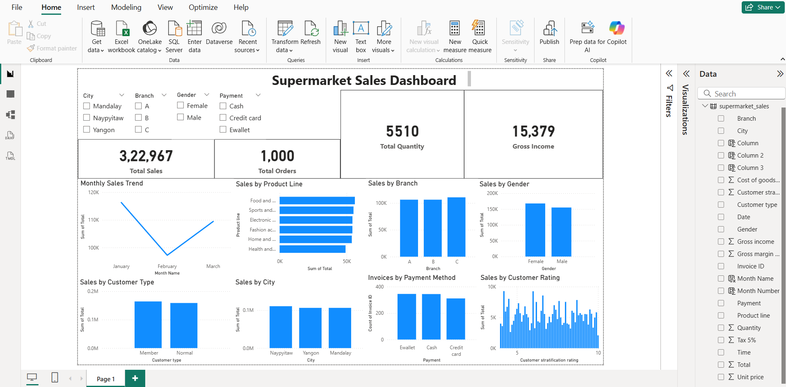
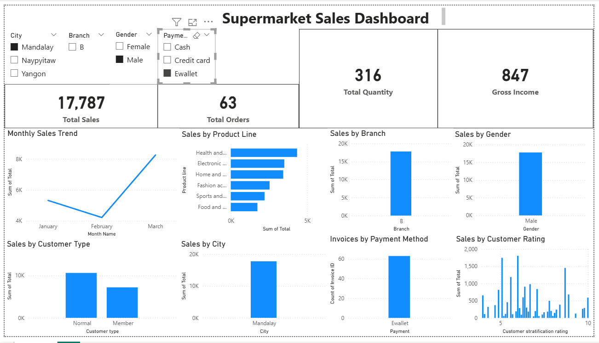

# 🛒 Supermarket Sales Data Analysis

## 📌 Project Overview

This project analyzes supermarket sales data using **Python, SQL, and Power BI** to identify sales trends, customer behavior, product performance, branch performance, and payment preferences. The final outcome is an interactive Power BI dashboard supported by Python exploratory data analysis and SQL queries.

---

## 🎯 Objective

* Analyze supermarket sales performance.
* Identify top-performing branches and product categories.
* Understand customer purchasing behavior.
* Compare payment methods and customer types.
* Build an interactive business dashboard.

---

## 🛠️ Tools & Technologies

* Python
* Pandas
* NumPy
* Matplotlib
* Seaborn
* SQLite
* SQL
* Power BI

---

## 📂 Project Structure

```text
supermarket_sales/
│
├── supermarket_sales.csv
├── supermarket_sales.db
├── mainfile.ipynb
├── Supermarket_Sales_Dashboard.pbix
└── README.md
```

---

## 📊 Key KPIs

| Metric              |      Value |
| ------------------- | ---------: |
| Total Sales         | 322,966.75 |
| Total Orders        |      1,000 |
| Total Quantity Sold |      5,510 |
| Gross Income        |  15,379.37 |
| Average Order Value |     322.97 |

---

## 📊 Power BI Dashboard

### Dashboard Overview



### Dashboard Analysis




## 📈 Dashboard Features

* Monthly Sales Trend
* Sales by Product Line
* Sales by Branch
* Sales by Gender
* Sales by Customer Type
* Sales by City
* Payment Method Analysis
* Customer Rating Analysis
* Interactive Slicers (City, Branch, Gender, Payment)

---

## 💡 Business Insights

* January generated the highest sales (**116,291.87**).
* Branch **C** achieved the highest overall sales.
* Food & Beverages was the best-performing product line.
* Member customers contributed slightly higher sales than normal customers.
* E-wallet was the most frequently used payment method.
* Average customer transaction value was **322.97**.

---

## 🚀 How to Run

1. Open `mainfile.ipynb` in Jupyter Notebook or VS Code.
2. Install required libraries.
3. Run all cells.
4. Open `Supermarket_Sales_Dashboard.pbix` in Power BI Desktop for the interactive dashboard.
